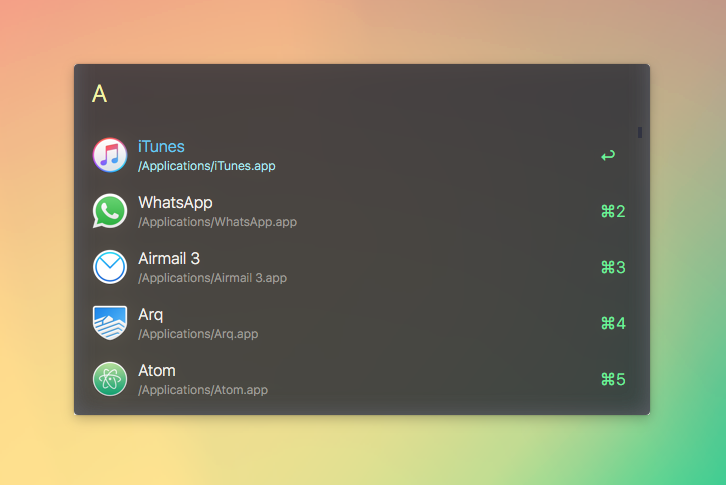
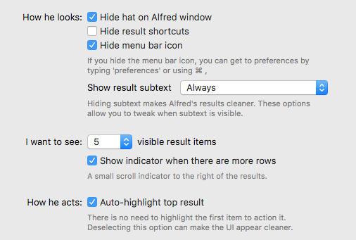

# alfred-snazzy

> Simple and elegant [Alfred](https://www.alfredapp.com/) theme with bright colors

## Install

_You need the [Powerpack](https://www.alfredapp.com/powerpack/) for custom themes_.

1. [Download](https://github.com/michelegera/alfred-snazzy/archive/refs/heads/master.zip) the latest version (ZIP file)
2. Unzip it
3. Double-click on `snazzy.alfredappearance`
4. Choose `Import`

## Options

Use the following options to have it look exactly like in the screenshot above.

## Related

- [`hyper-snazzy`](https://github.com/sindresorhus/hyper-snazzy) - [Hyper](https://hyper.is/) version
- [`iterm2-snazzy`](https://github.com/sindresorhus/iterm2-snazzy) - [iTerm2](https://www.iterm2.com/) version
- [`terminal-snazzy`](https://github.com/sindresorhus/terminal-snazzy) - Terminal version

## License

MIT © [Michele Gerarduzzi](https://github.com/michelegera)
